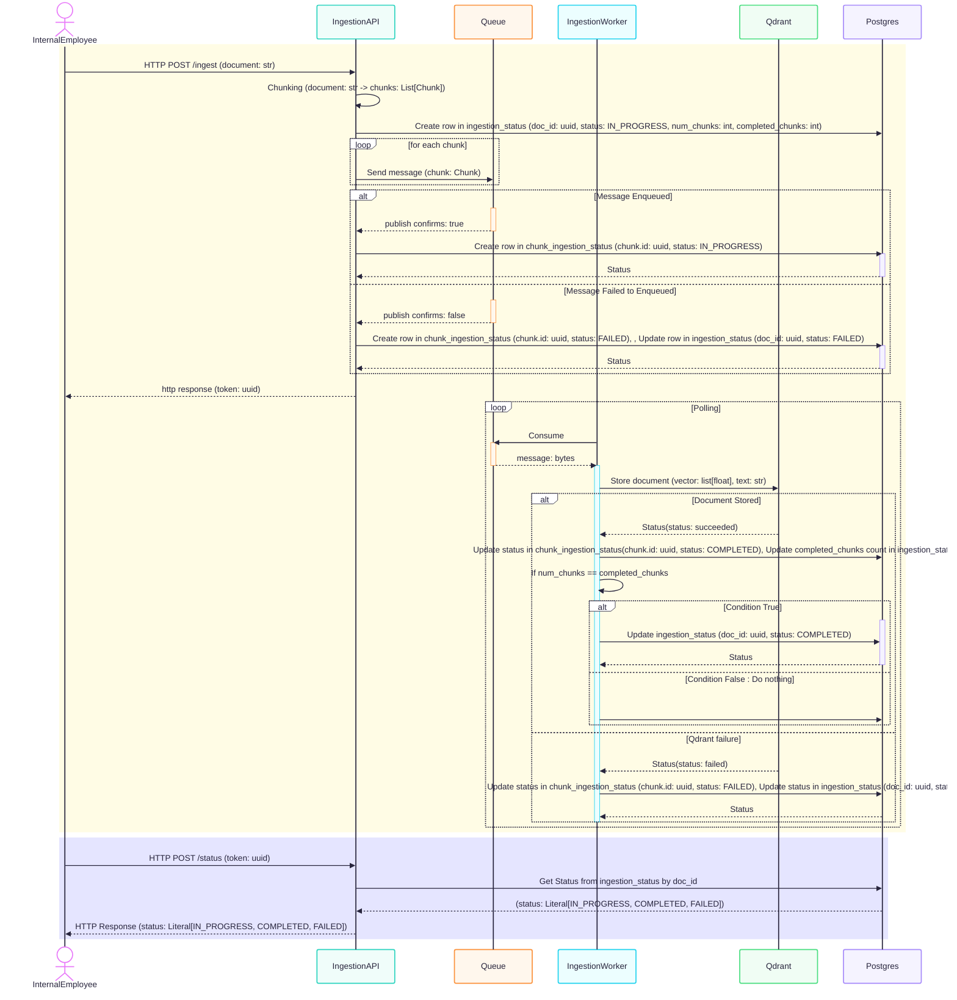

# Design Doc - Document Chunking for Ingestion
## Problem Statement
The encoder used during ingestion has a maximum token limit of 256 tokens. When documents exceed this limit, only the first 256 tokens are embedded and stored, resulting in:

- Loss of meaningful context from the rest of the document.

- Incomplete search results during retrieval.

- Performance issues with the /ask API when large documents are submitted unchunked.

## Objective
To preserve full document context and maintain system performance, we introduce a chunking mechanism during ingestion. This will:

- Split large documents into smaller, overlapping chunks.

- Track the ingestion status of each chunk individually.

- Mark the document as complete only when all chunks are successfully stored.

## Method

### Chunking Logic
- If a document exceeds 256 tokens, it is split into overlapping chunks using RecursiveCharacterTextSplitter to preserve semantic continuity.

- Each document is associated with a doc_id.

- Each chunk has:

  - A unique uuid (used to track chunk status)
  - Plaintext text
  - metadata, including:
    - chunk_index (starting from 0)
    - source (document origin)
    - doc_id (same as parent document)

### Ingestion Flow
1. User submits a document via the ingestion API
- The API tokenizes the document.
- If the token count exceeds 256, the document is split into chunks. Otherwise it is treated as a single chunk.
- A doc_id is generated and returned immediately to the user.
- Metadata is stored in Postgres:

  - A record in ingestion_status with:
    - doc_id
    - num_chunks
    - completed_chunks = 0
    - status = IN_PROGRESS

  - A record per chunk in chunk_ingestion_status, each with:
    - chunk_id
    - doc_id
    - chunk_index
    - status = IN_PROGRESS

2. Chunk submission
- Each chunk is published to a message queue by IngestionProducer.

3. Chunk processing
- IngestionWorker consumes messages from the queue.

- For each chunk:
  - It encodes the text.
  - Stores the embedding in the vector DB (Qdrant).

  - On success:
    - Updates chunk_ingestion_status to COMPLETED.
    - Increments stored_chunks in ingestion_status.

4. Document completion
- Once stored_chunks == expected_chunks, the document status is updated to COMPLETED in ingestion_status table.

### API for Status Retrieval
The user can poll /status api to check the ingestion status of the document. The endpoint checks:

- If status == COMPLETED, the document is fully processed.

- Otherwise, it may be IN_PROGRESS or FAILED.

### Postgres Schema

ingestion_status Table

```postgres
CREATE TABLE IF NOT EXISTS ingestion_status (
    id UUID PRIMARY KEY,
    status TEXT CHECK (status IN ('IN_PROGRESS', 'COMPLETED', 'FAILED')),
    error_message TEXT,
    updated_at TIMESTAMP DEFAULT NOW(),
    num_chunks INT DEFAULT 0,
    completed_chunks INT DEFAULT 0
);
```
chunk_ingestion_status Table

```postgres
CREATE TABLE IF NOT EXISTS chunk_ingestion_status (
    id UUID PRIMARY KEY,
    doc_id UUID REFERENCES ingestion_status(id) ON DELETE CASCADE,
    chunk_index INT,
    status TEXT CHECK (status IN ('IN_PROGRESS', 'COMPLETED', 'FAILED')),
    error_message TEXT,
    updated_at TIMESTAMP DEFAULT NOW()
);

```

### Sequence chart for Document chunking and ingestion workflow



