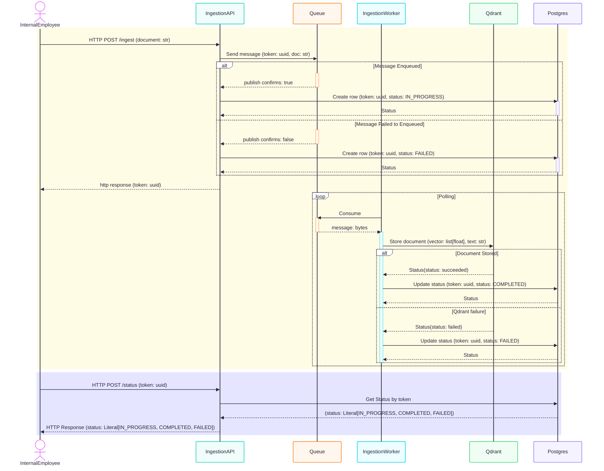

# Design Doc - Ingestion Status
## Problem Statement
User should be able to ask for status of the document submitted.

## Introduction
Currently the ingestion flow does not notify the user about the status of the ingestion request - whether it is still being processed, completed or failed. Following is the meaning of each status-

- IN_PROGRESS - The message has been sent to the queue
- COMPLETED - The document has been stored in the vector DB
- FAILED - The message was lost - it either failed to be sent to the queue or it failed to be stored in the vector DB

## Method
Ingestion API creates a table in Postgres with following schema -

```sql
CREATE TABLE ingestion_status (
    id UUID PRIMARY KEY,
    status TEXT CHECK (status IN ('IN_PROGRESS', 'COMPLETED', 'FAILED')),
    error_message TEXT,
    updated_at TIMESTAMP DEFAULT NOW()
);
```

 It stores the generated uuid along with IN_PROGRESS status after successfully publishing to the queue. If there was a failure in publishing, it the stores status as FAILED along with error message "Failed to publish to queue from ingestion api".\
 \
Ingestion worker also connects to the table in Postgres and updates status on consuming the message from the queue. It updates the status as COMPLETED on successful storage to qdrant or FAILED on failure in storing along with error message "Failed to store in qdrant from ingestion worker".



Request:

```http
POST http://localhost:8002/getStatus
Content-Type: application/json
{
    "token": UUID
}
```

Response: 

- 200 OK with the status if found

```http
{
    "status": Literal[IN_PROGRESS, COMPLETED, FAILED]
}
```

- 404 Not Found if the token was not found in Postgres
- 400 Bad Request if the token is missing or invalid
- 500 Internal Server Error for unexpected issues